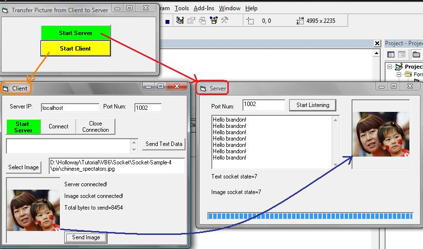



## Transfer Picture from Client to Server

### Description

This sample code in VB6 demonstrates sending picture or image file from a client to server software via Winsock using TCP.
 
### More Info
 
The challenges are:

(1). Maximum packet size using socket is 8191 bytes, thus if the picture/image is more than, the image will be transferred via socket in multiple packets.

(2). In VB6, I have discovered that array variable can only be passed as by reference (byRef) parameter. Since there is no way to pass an array byVal and there is no way to perform thread-concurrency on the process of winsock.GetData(), the best practice is to use 'variant' to fetch binary data which comes in multiple packets instead of using byte array.

1. Microsoft Common Dialog Control 6.0 (SP6)

2. Microsoft Windows Common Controls 5.0 (SP6)

3. Microsoft Winsock Control

             |
---                |---
**Submitted On**   |2009-11-11 17:42:08
**By**             |[brandon teoh](https://github.com/Planet-Source-Code/PSCIndex/blob/master/ByAuthor/brandon-teoh.md)
**Level**          |Intermediate
**User Rating**    |4.2 (21 globes from 5 users)
**Compatibility**  |VB 6\.0
**Category**       |[Coding Standards](https://github.com/Planet-Source-Code/PSCIndex/blob/master/ByCategory/coding-standards__1-43.md)
**World**          |[Visual Basic](https://github.com/Planet-Source-Code/PSCIndex/blob/master/ByWorld/visual-basic.md)
**Archive File**   |[Transfer\_P21688611292009\.zip](https://github.com/Planet-Source-Code/brandon-teoh-transfer-picture-from-client-to-server__1-72687/archive/master.zip)

